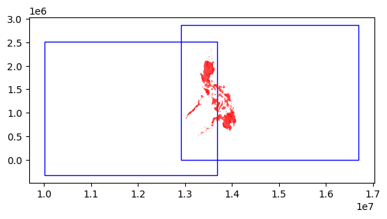

~~Nightlights for Damage Assessment~~ Nightlights Processing Utilities
================

<!-- WARNING: THIS FILE WAS AUTOGENERATED! DO NOT EDIT! -->

## Install

`pip install git+https://github.com/butchland/ntlights-processing-utils.git`

## How to use

-   ~~Download the nightlights satellite imagery for the period before
    and after the disaster~~
-   ~~Download the geospatial admin boundaries for the areas concerned~~
-   ~~Download and scrape the damage assessment situationers as ground
    truth~~
-   ~~Preprocess the situationrers to extract the locations and damage
    assessment~~
-   ~~Wrangle and link the damage assessment locations to the admin
    boundaries~~
-   ~~Extract the radiance data from the nightlights satellite~~
-   ~~Analyze the patterns for radiance data for highly damaged areas vs
    undamaged or low damage areas~~
-   ~~Write up conclusions~~

### Query what images are relevant for what dates and what areas

-   Fetch monthly catalogs of VIIRS NDB night lights imagery (2012-2020)
-   Create a searchable database of images for each day of all the night
    lights images
-   Create an API to search and filter images by date and area boundary
    (as well as cache! the metadata)
-   Create an API to evaluate overlap of images to area boundary
-   Create an API to download selected images

Lets start with an GeoDataFrame that is the bounding box of the AOI
(Philippines)

``` python
aoi = gpd.read_file('../data/admin_areas/ph_admin_bbox_wgs84.geojson')
```

Lets search for images overlapping the AOI for a particular date, in
this case `20180501` or May 1, 2018

``` python
matched = search_dates_aoi(aoi, date_param='20180501')
```

    CPU times: user 79.7 ms, sys: 60.1 ms, total: 140 ms
    Wall time: 137 ms

Notice how fast the retrieval is – that’s because the particular date
has already been cached.

> *For dates that haven’t been cached, the time can take between 10-15
> minutes, depending on the internet speed*.

``` python
len(matched)
```

    5

There are 5 images for the date that overlaps the AOI, but which ones
are the most relevant?

``` python
matched
```

<div>
<style scoped>
    .dataframe tbody tr th:only-of-type {
        vertical-align: middle;
    }

    .dataframe tbody tr th {
        vertical-align: top;
    }

    .dataframe thead th {
        text-align: right;
    }
</style>
<table border="1" class="dataframe">
  <thead>
    <tr style="text-align: right;">
      <th></th>
      <th>href</th>
      <th>item_href</th>
      <th>stem</th>
      <th>suffix</th>
      <th>base_url</th>
      <th>folder</th>
      <th>product_id</th>
      <th>start_date</th>
      <th>first_scantime</th>
      <th>end_scantime</th>
      <th>orbital_nbr</th>
      <th>create_datetime</th>
      <th>data_origin</th>
      <th>data_domain</th>
      <th>vflag_file</th>
      <th>vflag_href</th>
      <th>cache_stem</th>
      <th>asset_href</th>
      <th>geometry</th>
    </tr>
  </thead>
  <tbody>
    <tr>
      <th>80</th>
      <td>./SVDNB_npp_d20180501_t1634142_e1639546_b33728_c20180501223954897862_noac_ops.rade9.co.json</td>
      <td>https://globalnightlight.s3.amazonaws.com/npp_201805/SVDNB_npp_d20180501_t1634142_e1639546_b33728_c20180501223954897...</td>
      <td>SVDNB_npp_d20180501_t1634142_e1639546_b33728_c20180501223954897862_noac_ops</td>
      <td>rade9.co.json</td>
      <td>https://globalnightlight.s3.amazonaws.com</td>
      <td>npp_201805</td>
      <td>SVDNB_npp</td>
      <td>20180501</td>
      <td>1634142</td>
      <td>1639546</td>
      <td>33728</td>
      <td>20180501223954897862</td>
      <td>noac</td>
      <td>ops</td>
      <td>npp_d20180501_t1634142_e1639546_b33728.vflag.co.tif</td>
      <td>https://globalnightlight.s3.amazonaws.com/npp_201805/npp_d20180501_t1634142_e1639546_b33728.vflag.co.tif</td>
      <td>SVDNB_npp_d20180501_t1634142_e1639546_b33728_c20180501223954897862_noac_ops</td>
      <td>https://globalnightlight.s3.amazonaws.com/npp_201805/SVDNB_npp_d20180501_t1634142_e1639546_b33728_c20180501223954897...</td>
      <td>POLYGON ((118.99800 19.00210, 118.99800 44.00210, 157.99800 44.00210, 157.99800 19.00210, 118.99800 19.00210))</td>
    </tr>
    <tr>
      <th>81</th>
      <td>./SVDNB_npp_d20180501_t1639558_e1645362_b33728_c20180501224536066966_noac_ops.rade9.co.json</td>
      <td>https://globalnightlight.s3.amazonaws.com/npp_201805/SVDNB_npp_d20180501_t1639558_e1645362_b33728_c20180501224536066...</td>
      <td>SVDNB_npp_d20180501_t1639558_e1645362_b33728_c20180501224536066966_noac_ops</td>
      <td>rade9.co.json</td>
      <td>https://globalnightlight.s3.amazonaws.com</td>
      <td>npp_201805</td>
      <td>SVDNB_npp</td>
      <td>20180501</td>
      <td>1639558</td>
      <td>1645362</td>
      <td>33728</td>
      <td>20180501224536066966</td>
      <td>noac</td>
      <td>ops</td>
      <td>npp_d20180501_t1639558_e1645362_b33728.vflag.co.tif</td>
      <td>https://globalnightlight.s3.amazonaws.com/npp_201805/npp_d20180501_t1639558_e1645362_b33728.vflag.co.tif</td>
      <td>SVDNB_npp_d20180501_t1639558_e1645362_b33728_c20180501224536066966_noac_ops</td>
      <td>https://globalnightlight.s3.amazonaws.com/npp_201805/SVDNB_npp_d20180501_t1639558_e1645362_b33728_c20180501224536066...</td>
      <td>POLYGON ((115.99800 0.00206, 115.99800 25.00210, 149.99800 25.00210, 149.99800 0.00206, 115.99800 0.00206))</td>
    </tr>
    <tr>
      <th>82</th>
      <td>./SVDNB_npp_d20180501_t1645375_e1651161_b33728_c20180501225118045996_noac_ops.rade9.co.json</td>
      <td>https://globalnightlight.s3.amazonaws.com/npp_201805/SVDNB_npp_d20180501_t1645375_e1651161_b33728_c20180501225118045...</td>
      <td>SVDNB_npp_d20180501_t1645375_e1651161_b33728_c20180501225118045996_noac_ops</td>
      <td>rade9.co.json</td>
      <td>https://globalnightlight.s3.amazonaws.com</td>
      <td>npp_201805</td>
      <td>SVDNB_npp</td>
      <td>20180501</td>
      <td>1645375</td>
      <td>1651161</td>
      <td>33728</td>
      <td>20180501225118045996</td>
      <td>noac</td>
      <td>ops</td>
      <td>npp_d20180501_t1645375_e1651161_b33728.vflag.co.tif</td>
      <td>https://globalnightlight.s3.amazonaws.com/npp_201805/npp_d20180501_t1645375_e1651161_b33728.vflag.co.tif</td>
      <td>SVDNB_npp_d20180501_t1645375_e1651161_b33728_c20180501225118045996_noac_ops</td>
      <td>https://globalnightlight.s3.amazonaws.com/npp_201805/SVDNB_npp_d20180501_t1645375_e1651161_b33728_c20180501225118045...</td>
      <td>POLYGON ((110.99800 -19.99790, 110.99800 5.00208, 143.99800 5.00208, 143.99800 -19.99790, 110.99800 -19.99790))</td>
    </tr>
    <tr>
      <th>89</th>
      <td>./SVDNB_npp_d20180501_t1816398_e1822184_b33729_c20180502002220226537_noac_ops.rade9.co.json</td>
      <td>https://globalnightlight.s3.amazonaws.com/npp_201805/SVDNB_npp_d20180501_t1816398_e1822184_b33729_c20180502002220226...</td>
      <td>SVDNB_npp_d20180501_t1816398_e1822184_b33729_c20180502002220226537_noac_ops</td>
      <td>rade9.co.json</td>
      <td>https://globalnightlight.s3.amazonaws.com</td>
      <td>npp_201805</td>
      <td>SVDNB_npp</td>
      <td>20180501</td>
      <td>1816398</td>
      <td>1822184</td>
      <td>33729</td>
      <td>20180502002220226537</td>
      <td>noac</td>
      <td>ops</td>
      <td>npp_d20180501_t1816398_e1822184_b33729.vflag.co.tif</td>
      <td>https://globalnightlight.s3.amazonaws.com/npp_201805/npp_d20180501_t1816398_e1822184_b33729.vflag.co.tif</td>
      <td>SVDNB_npp_d20180501_t1816398_e1822184_b33729_c20180502002220226537_noac_ops</td>
      <td>https://globalnightlight.s3.amazonaws.com/npp_201805/SVDNB_npp_d20180501_t1816398_e1822184_b33729_c20180502002220226...</td>
      <td>POLYGON ((93.99790 16.00210, 93.99790 41.00210, 130.99800 41.00210, 130.99800 16.00210, 93.99790 16.00210))</td>
    </tr>
    <tr>
      <th>90</th>
      <td>./SVDNB_npp_d20180501_t1822196_e1828000_b33729_c20180502002801307723_noac_ops.rade9.co.json</td>
      <td>https://globalnightlight.s3.amazonaws.com/npp_201805/SVDNB_npp_d20180501_t1822196_e1828000_b33729_c20180502002801307...</td>
      <td>SVDNB_npp_d20180501_t1822196_e1828000_b33729_c20180502002801307723_noac_ops</td>
      <td>rade9.co.json</td>
      <td>https://globalnightlight.s3.amazonaws.com</td>
      <td>npp_201805</td>
      <td>SVDNB_npp</td>
      <td>20180501</td>
      <td>1822196</td>
      <td>1828000</td>
      <td>33729</td>
      <td>20180502002801307723</td>
      <td>noac</td>
      <td>ops</td>
      <td>npp_d20180501_t1822196_e1828000_b33729.vflag.co.tif</td>
      <td>https://globalnightlight.s3.amazonaws.com/npp_201805/npp_d20180501_t1822196_e1828000_b33729.vflag.co.tif</td>
      <td>SVDNB_npp_d20180501_t1822196_e1828000_b33729_c20180502002801307723_noac_ops</td>
      <td>https://globalnightlight.s3.amazonaws.com/npp_201805/SVDNB_npp_d20180501_t1822196_e1828000_b33729_c20180502002801307...</td>
      <td>POLYGON ((89.99790 -2.99794, 89.99790 22.00210, 122.99800 22.00210, 122.99800 -2.99794, 89.99790 -2.99794))</td>
    </tr>
  </tbody>
</table>
</div>

One way to answer the question is by taking the amount of overlap each
image makes over the AOI and sorts them from the highest to the lowest.

``` python
sorted_results = compute_overlaps(aoi,matched)
```

    CPU times: user 73.3 ms, sys: 0 ns, total: 73.3 ms
    Wall time: 69.9 ms

``` python
sorted_results[['pct_covered']].head()
```

<div>
<style scoped>
    .dataframe tbody tr th:only-of-type {
        vertical-align: middle;
    }

    .dataframe tbody tr th {
        vertical-align: top;
    }

    .dataframe thead th {
        text-align: right;
    }
</style>
<table border="1" class="dataframe">
  <thead>
    <tr style="text-align: right;">
      <th></th>
      <th>pct_covered</th>
    </tr>
  </thead>
  <tbody>
    <tr>
      <th>81</th>
      <td>0.860461</td>
    </tr>
    <tr>
      <th>90</th>
      <td>0.707395</td>
    </tr>
    <tr>
      <th>89</th>
      <td>0.317353</td>
    </tr>
    <tr>
      <th>80</th>
      <td>0.081804</td>
    </tr>
    <tr>
      <th>82</th>
      <td>0.024449</td>
    </tr>
  </tbody>
</table>
</div>

Based on the `pct_covered` it looks like the first 2 are good candidates
to hold relevant data over the AOI

``` python
aoi_ph = gpd.read_file('../data/admin_areas/phl_admbnda_adm3_psa_namria_20200529.shp')
aoi_ph_planar = aoi_ph.to_crs('EPSG:3857')
ax = plt.axes()
ax = sorted_results[:2].plot(ax=ax, facecolor='none', edgecolor='blue')
ax = aoi_ph_planar.plot(ax=ax,color='red')
```



So the results do look good for the top 2 areas as between them, they
cover the entire AOI.

Now, lets download the relevant images

``` python
top2_items = sorted_results[:2].copy()
```

``` python
top2_items = download_items(top2_items, dest='../data/ntlights-bigfiles')
```

    CPU times: user 7.02 ms, sys: 1.55 ms, total: 8.57 ms
    Wall time: 6.76 ms

Notice how fast the times are

> *this is because the files were already downloaded into the directory
> – the time taken to download new files can take about 10-15 minutes
> depending on your internet connection*

``` python
top2_items[['image_path']]
```

<div>
<style scoped>
    .dataframe tbody tr th:only-of-type {
        vertical-align: middle;
    }

    .dataframe tbody tr th {
        vertical-align: top;
    }

    .dataframe thead th {
        text-align: right;
    }
</style>
<table border="1" class="dataframe">
  <thead>
    <tr style="text-align: right;">
      <th></th>
      <th>image_path</th>
    </tr>
  </thead>
  <tbody>
    <tr>
      <th>81</th>
      <td>/home/butch2/play/devpost/ntlights-damage-assessment/nbs/../data/ntlights-bigfiles/npp_201805/SVDNB_npp_d20180501_t1...</td>
    </tr>
    <tr>
      <th>90</th>
      <td>/home/butch2/play/devpost/ntlights-damage-assessment/nbs/../data/ntlights-bigfiles/npp_201805/SVDNB_npp_d20180501_t1...</td>
    </tr>
  </tbody>
</table>
</div>

These now display the path to image files – which you can then open for
analysis using rasterio or any other python package.
